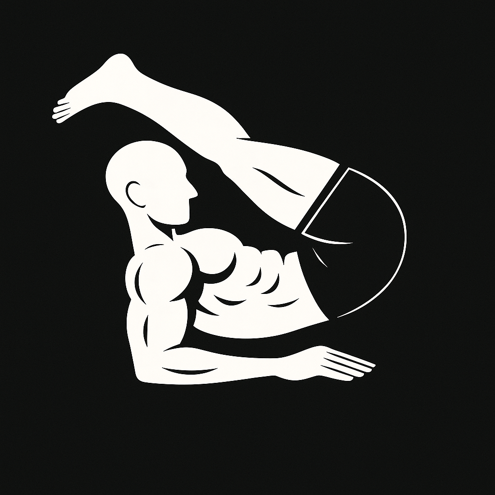

# Calisthenics-Website

Meu site de calistenia — um portfólio visual dedicado exclusivamente à minha evolução como atleta calistênico.

O **Calisthenics-Website** é uma plataforma onde compartilho minha trajetória na prática da calistenia: falo sobre minha história, conquistas e principais habilidades, como poses estáticas, transições desafiadoras, equilíbrio, força e flexibilidade. Também apresento uma galeria com fotos organizadas por progressões e momentos marcantes da minha jornada. Cada seção do site reflete uma fase do meu desenvolvimento — desde as primeiras variações até execuções avançadas como Forearm Manna, One Arm Pincha, Dragon Squat, espacates, entre outras.

Mais do que um conjunto de imagens, este projeto é o registro de anos de prática, disciplina e evolução constante. É uma vitrine do meu comprometimento com o movimento corporal e com a liberdade que ele proporciona.Tudo apresentado com um layout limpo, direto e responsivo — deixando o foco total no que importa: **o corpo em movimento**.

**Veja o site em ação [aqui](https://abelarduu.github.io/Calisthenics-Portfolio/)!** 💪📸

### Resultado

